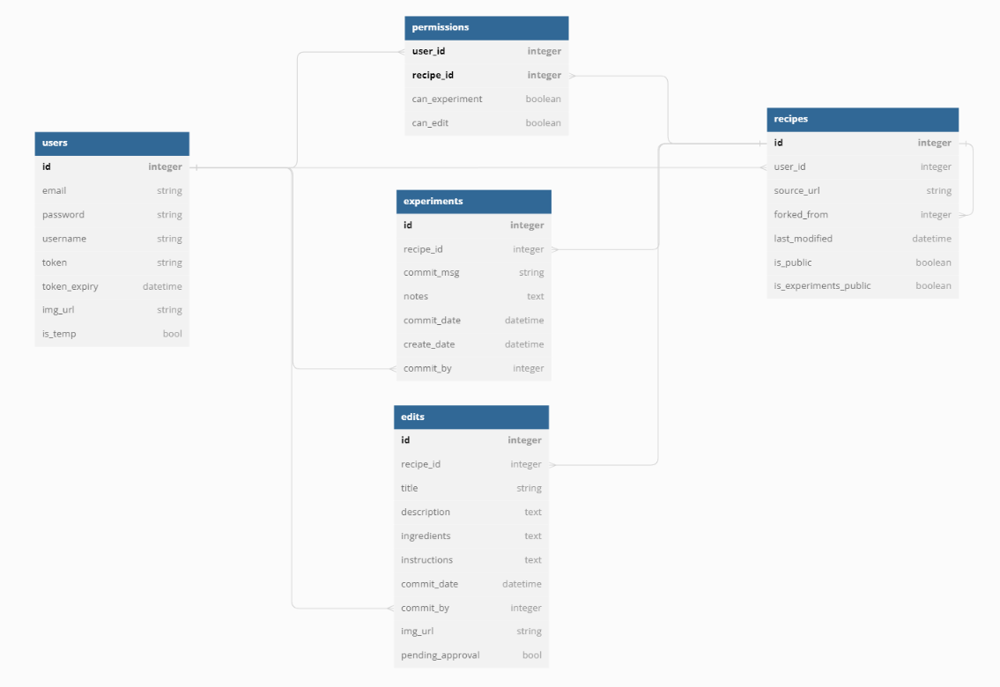

# Forkd: Recipe Journal and Version Control


<figure>

<a href="https://www.youtube.com/watch?v=ZVaxeGYfDWc">
<figcaption>Demo video on Youtube</figcaption>
</a>

<a href="3.14.77.97">Live Demo Site</a>
</figure>

An app where users can save, record 'experiments', and track edits for recipes.

This is the backend repo corresponding to the frontend [here](https://github.com/bianxm/forkd-frontend).

## Features
- Save recipes, which can be inputted by the user, or extracted from a webpage
- Log 'experiments' to recipes
- Track edits to recipes by saving snapshots of the recipe after an edit, git-style 
- Delete recipes, experiments, and edits
- Control global and per-user permissions to recipes
- Edit user settings such as username, email, password, and avatar

## Technologies Used
- PostgreSQL database
- Flask backend
- [Spoonacular API](https://spoonacular.com/food-api) for recipe extraction from webpage
- [Flask-HTTPAuth](https://github.com/miguelgrinberg/Flask-HTTPAuth) for authentication
- Cloudinary API for image upload

## Data Model

<figure><figcaption>Data Model</figcaption></figure>

[Here](https://dbdiagram.io/d/6428e0565758ac5f1725ff32), 5 tables
* Users table - email, password, username
* Recipes table - title, description, some metadata
* Experiments table -  title, dates, notes
* Edits table - historical data for recipe edits
* Permissions table - associating a recipe and a user, and the user's permission level for that recipe

## Roadmap

### MVP

- [x] Users can login to see their saved recipes and the corresponding "experiments"
- [x] Users can add "experiments" under each recipe, where they can log:
  - when
  - what they did different
  - the outcome
  - photos? 
- [x] Users can add "edits" under each recipe, which tracks the changes they've made to the recipe
  - [JSDiff](https://github.com/kpdecker/jsdiff) to get diffs
  - [Diff2HTML](https://github.com/rtfpessoa/diff2html) to display diffs
- [x] Fork a recipe (that you can then add your own experiments to)
- [x] Spoonacular API: Get a recipe from the internet


### 2.0
- [x] Rewrite backend as RESTful API
- [x] Add permissions and sharing functionality to backend
  - Users can view other users' public recipes, but not their experiments!
  - set all your experiments for a recipe to be public as well
  - share your recipe with a different user, and they can add experiments to the recipe 
- [x] React SPA frontend ([in progress](https://github.com/bianxm/forkd-frontend))
- [x] Temp user -- all db changes made deleted on logout (so users can try out the app for one session)
- [x] Update user details (avatar, username, email, password)
  - [x] User avatar image upload via Cloudinary
- [ ] Test coverage (currently 52%, but all pass; doesn't quite cover permissions route)

### 2.5
- [ ] Edit experiments -- implemented but not tested
- [ ] Edit "pull request" -- experimenter can propose an edit, which will then have to be approved by editor or owner (half-implemented, have to deal with earlier assumption that the latest edit represents the current version of an experiment. it should be the first edit _that isn't pending approval_. Might require data model changes)
- [ ] Save experiment "draft", that can later be committed -- implemented but not tested

### Nice-to-haves/ Future features
- [ ] Recipe tagging and search
- [ ] Friends list (for sharing autocomplete as well)
- [ ] Fully migrate to SQLAlchemy v2.x
- [ ] Email support -- confirm on sign-up, use for password reset emails
- [ ] Extend image upload support to recipe image, and perhaps support interspersing multiple images in experiment notes (markdown)
- [ ] Delete/ deactivate non-temp user

## Install locally
1. Clone this repo
2. Create your virtual environment and activate.
3. Install everything in requirements.txt with ```pip3 install -r requirements.txt```
4. Set up your database. You can either run ```python3 model.py recreate <username:password@host:port/db_name>```, which will set up the schema for you but leave you with an empty database. Alternatively, for some dummy data, you can run ```python3 seed_database.py <username:password@host:port/db_name>```. (If you are using a different flavor of SQL than Postgres, you'll have to edit line 308 on model.py to replace 'postgres' with whatever one you are using.)
4. Copy .env.example and replace all variable values to the relevant values for you. You will need a Spoonacular key, a Cloudinary secret and key, and a Flask secret key (which can be any random string), as well as your dev database uri. Rename to '.env'.
4. Run the Flask dev server with ```python3 api_server.py```
5. Go to the [corresponding frontend repo](https://github.com/bianxm/forkd-frontend) for installation instructions for that.

## Sources
- This is my capstone project for [Hackbright Academy](https://hackbrightacademy.com/), which taught us Python, Flask, Javascript, and React from the ground up in a whirlwind five weeks. 
- I am also deeply indebted to Miguel Grinberg's hefty [Flask Mega-Tutorial](https://blog.miguelgrinberg.com/post/the-flask-mega-tutorial-part-i-hello-world), in particular for the authentication implementation.
